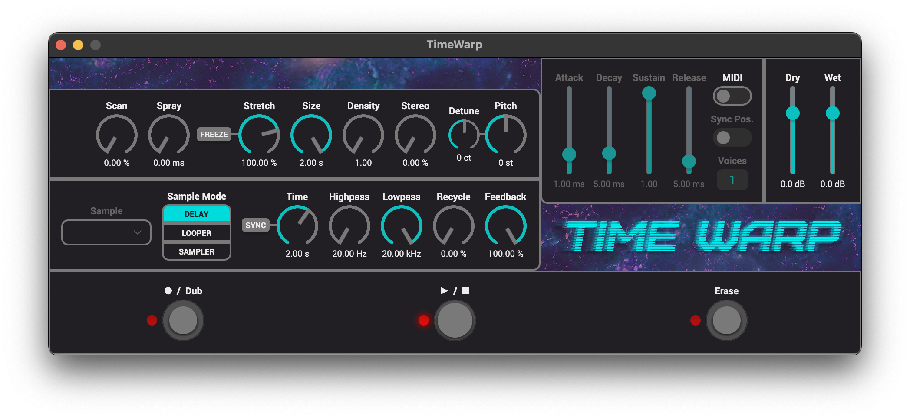

## TimeWarp

### A granular delay, looper & sampler built for sonic exploration.
Capture live audio or import samples, then independently stretch time and transpose
pitch to create everything from subtle enhancements to lush soundscapes. Connect a
MIDI device to achieve polyphony, transforming any sound source into a playable, multi-layered instrument.

The effect can be compiled to a [MOD audio](https://mod.audio/), VST3, CLAP, AUv2 or LV2 plugin.

## Table of contents:

- [VST3, CLAP, AUv2 & LV2 installation](#VST3-CLAP-AUv2-&-LV2-installation)
- [MOD installation](#MOD-installation)
- [Copyright notices](#Copyright-notices)

## VST3, CLAP, AUv2 & LV2 installation

You can download the VST3, CLAP, AUv2 & LV2 plugins from the [releases page](https://github.com/davemollen/dm-TimeWarp/releases).

The LV2 plugin doesn't have a GUI unless you run the plugin in MOD Desktop.

On macOS you may need to [disable Gatekeeper](https://disable-gatekeeper.github.io/) as Apple has recently made it more difficult to run unsigned code on macOS.

## MOD installation

Install the plugin from the MOD Audio plugin store.

The latest MOD builds can also be found on the [releases page](https://github.com/davemollen/dm-TimeWarp/releases).

If you want to build the plugin on your own machine check out the [mod-plugin-builder repository](https://github.com/moddevices/mod-plugin-builder) for instructions.

## Copyright notices

VST is a trademark of Steinberg Media Technologies GmbH, registered in Europe and other countries.

